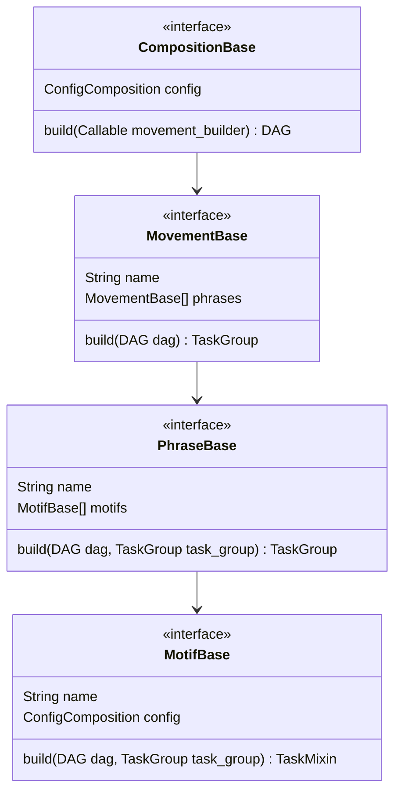

# Debussy Concert
Abstraction layers for Apache Airflow with musical theme. Depends on debussy_framework

Mount examples folder on airflow dags folder

```mermaid
classDiagram
class CompositionBase {
    <<interface>>
    ConfigComposition config
    build(Callable movement_builder) DAG
}

class MovementBase {
    <<interface>>
    String name
    MovementBase[] phrases
    build(DAG dag) TaskGroup
}

class PhraseBase{
    <<interface>>
    String name
    MotifBase[] motifs
    build(DAG dag, TaskGroup task_group) TaskGroup
}

class MotifBase {
    <<interface>>
    String name
    ConfigComposition config
    build(DAG dag, TaskGroup task_group) TaskMixin
}

CompositionBase --> MovementBase
MovementBase --> PhraseBase
PhraseBase --> MotifBase
```
