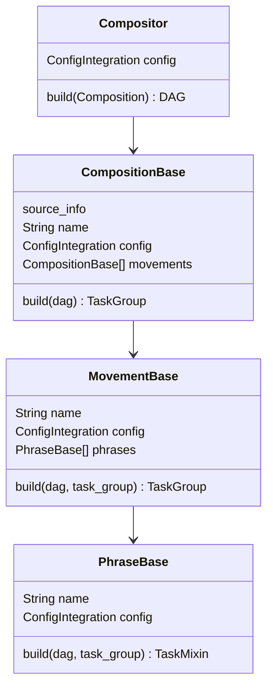

# AirflowConcert
Abstraction layers for Apache Airflow with musical theme

Mount examples folder on airflow dags folder

```mermaid
classDiagram
class Compositor {
    ConfigIntegration config
    build(Composition) DAG
}

class CompositionBase {
    source_info
    String name
    ConfigIntegration config
    CompositionBase[] movements
    build(dag) TaskGroup
}

class MovementBase{
    String name
    ConfigIntegration config
    PhraseBase[] phrases
    build(dag, task_group) TaskGroup
}

class PhraseBase {
    String name
    ConfigIntegration config
    build(dag, task_group) TaskMixin
}

CompositionBase --> MovementBase
MovementBase --> PhraseBase
Compositor --> CompositionBase
```